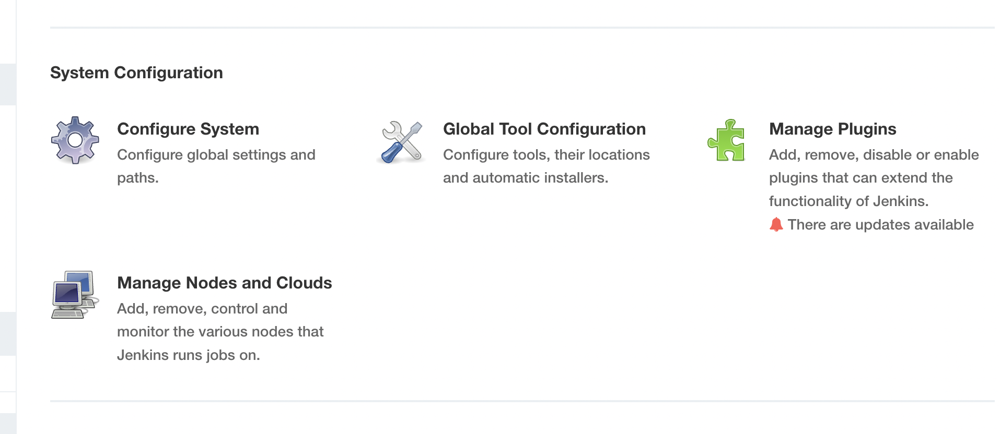
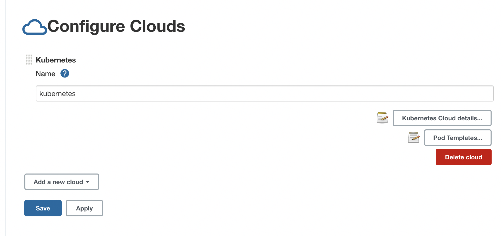
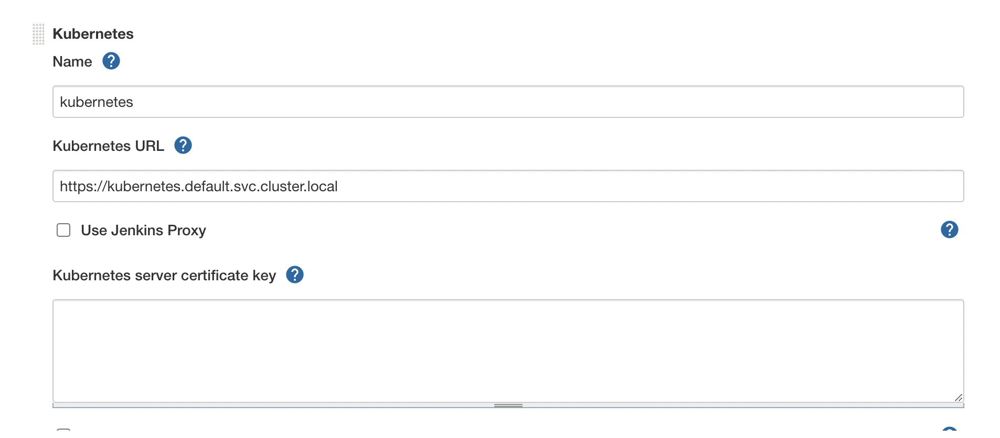
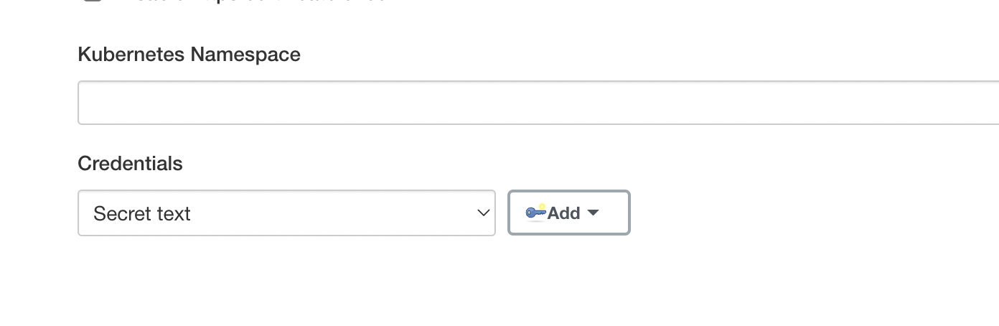
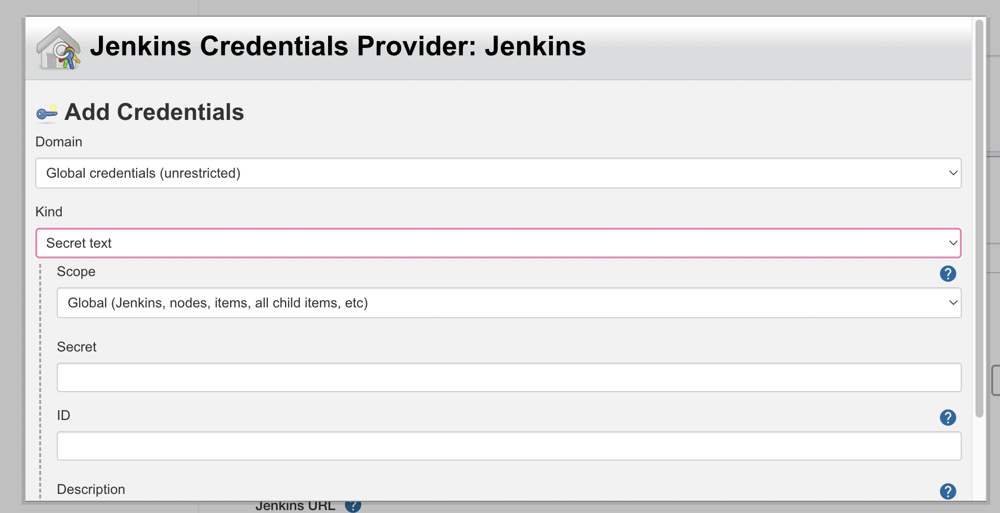
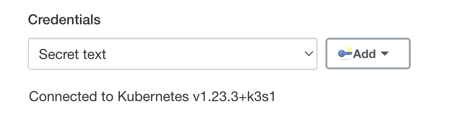
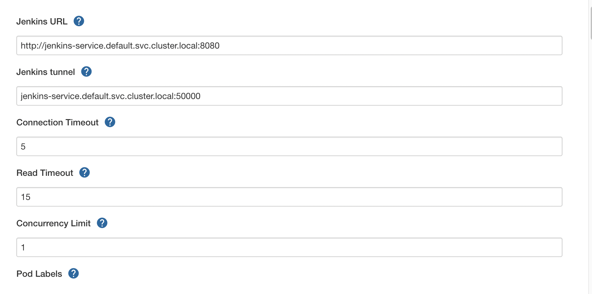
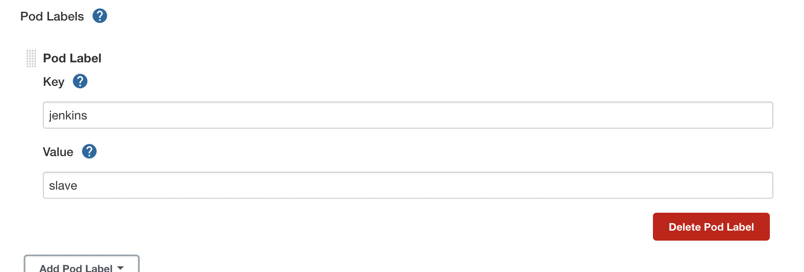

### 准备工作

由于线上的小鸡性能过于赢弱，所以并不会真正的直接上k8s，而是使用性能较差设备用的k3s上，基本上的功能都有，体验与k8s并没有什么不同

### 安装K3s

可以直接使用官网的一键安装：
```bash
curl -sfL https://get.k3s.io | sh -
```

也可以直接去官方github下载二进制文件，然后转移到系统的/usr/local/bin，然后修改权限chmod 755 k3s

然后设置变量，跳过脚本的下载

```bash
export INSTALL_K3S_SKIP_DOWNLOAD=true
```

然后将get.k3s.io的安装脚本执行。

### 安装Docker
docker安装很简单，几句命令一键安装即可

### 在k3s里运行jenkins

将jenkins作为一个pod在k3s里运行

deployment和service的yaml文件如下：

```yaml
apiVersion: v1
kind: Service
metadata:
  name: jenkins-service
  labels:
    app: jenkins
spec:
  type: NodePort
  selector:
      app: jenkins
  ports:
  - protocol: TCP
    nodePort: 30080
    port: 8080
    name: web
    targetPort: 8080
  - protocol: TCP
    port: 50000
    name: agent
    targetPort: 50000

---

apiVersion: apps/v1
kind: Deployment
metadata:
  name: jenkins
spec:
  replicas: 1
  selector:
    matchLabels:
      app: jenkins
  template:
    metadata:
      labels:
        app: jenkins
    spec:
      containers:
      - image: jenkinsci/blueocean:latest
        name: jenkins-container
        ports:
        - containerPort: 8080
          name: jenkins-8080
          protocol: TCP
        - containerPort: 50000
          name: jenkins-50000
          protocol: TCP
        volumeMounts:
        - name: jenkins-persistent-data
          mountPath: /var/jenkins_home
      volumes:
      - name: jenkins-persistent-data
        persistentVolumeClaim:
          claimName: jenkins-pv-data-claim
```

pv和pvc的文件如下：

```yaml
apiVersion: v1
kind: PersistentVolume
metadata:
  name: jenkins-pv-data
  labels:
    type: local
spec:
  storageClassName: jenkins-data
  capacity:
    storage: 512Mi
  accessModes:
    - ReadWriteOnce
  hostPath:
    path: "/your_path/jenkins_home"

---
apiVersion: v1
kind: PersistentVolumeClaim
metadata:
  name: jenkins-pv-data-claim
spec:
  storageClassName: jenkins-data
  accessModes:
    - ReadWriteOnce
  resources:
    requests:
      storage: 512Mi
```
这里的镜像选择了更加现代化的jenkins blueocean

创建好yaml后，分别执行:
```bash
kubectl apply -f deploy-jenkins.yaml
kubectl apply -f jenkins-pv-pvc.yaml
```

然后执行kubectl get pods，就可以看到pods正在运行了。

```bash
NAME                       READY   STATUS    RESTARTS      AGE
jenkins-695724d564-qskbk   1/1     Running   0             1s
```

### Jenkins设置

执行`kubectl logs <your jenkins pods NAME>`，查看日志即可看到初始密码，选择安装默认插件

然后进入到主界面，从Manage Jenkins->Manage Plugins，在available里搜索`Kubernetes`插件，然后安装。

安装完后，点击`Manage Nodes and Clouds`



进入后点击Clouds，然后Add new clouds，选择Kubernetes，点开detail



首先设置k8s url, 由于jenkins是运行在k3s内，可以直接填写k8s api server的地址，可以通过在k3s里运行一个busybox来查看地址，注意busybox版本要用1.28.3，其他版本无法查看DNS

运行一个busybox

```bash
kubectl run -it --image=busybox:1.28.3 --restart=Never dns-test /bin/sh
```

查看地址

```bash
nslookup kubernetes

Server:    10.43.0.10
Address 1: 10.43.0.10 kube-dns.kube-system.svc.cluster.local

Name:      kubernetes
Address 1: 10.43.0.1 kubernetes.default.svc.cluster.local
```
将k8s url填写进去：



### k8s创建SA证书

由于jenkins连接k8s需要验证，有很多种方式可以提供访问凭证，这里仅提供SA证书的token访问方式

首先创建一个名为jenkins的sa

```bash
kubectl create sa jenkins
```

然后绑定

```bash
kubectl create clusterrolebinding jenkins --clusterrole cluster-admin --serviceaccount=default:jenkins
```

然后获取该证书的一些信息

```bash
kubectl describe sa jenkins -n default

Name:                jenkins
Namespace:           default
Labels:              <none>
Annotations:         <none>
Image pull secrets:  <none>
Mountable secrets:   jenkins-token-drc5q
Tokens:              jenkins-token-drc5q
Events:              <none>
```

获取证书token

```bash
kubectl describe secrets jenkins-token-drc5q -n default

Name:         jenkins-token-drc5q
Namespace:    default
Labels:       <none>
Annotations:  kubernetes.io/service-account.name: jenkins
              kubernetes.io/service-account.uid: f2f806c9-a71d-43e9-b65c-0d3997666770

Type:  kubernetes.io/service-account-token

Data
====
ca.crt:     570 bytes
namespace:  7 bytes
token:     <实际token内容>
```

### jenkins创建Credentials访问k8s

点击Add创建



kind选择secret text，将刚刚获取到token内容填入secret，点击add



然后Credentials选中刚刚创建的，点击旁边的test connection，如果连接成功，则显示



可以在busybox里查看jenkins的地址

```bash
nslookup jenkins-service

Server:    10.43.0.10
Address 1: 10.43.0.10 kube-dns.kube-system.svc.cluster.local

Name:      jenkins-service
Address 1: 10.43.82.142 jenkins-service.default.svc.cluster.local
```

然后填入，注意一定要填入端口号



再往下，可以设置一下随机生成的jenkins slave pod的label



再往下可以设置一些镜像模版，然后再jenkins流水线里直接选用，出于简洁和好管理，镜像模版这边会选择写在pipline文件里

### 创建Jenkins流水线，实现CI/CD

下面是一个简单的pipeline文件

```bash
def label = "test-k8s-${UUID.randomUUID().toString()}"
podTemplate(label: label, // See 1
  containers: [
    containerTemplate(
      name: 'jnlp',
      image: 'jenkins/inbound-agent:alpine',
    ),
    containerTemplate(name: 'kubectl', image: 'yuantaosu/kubectl-alpine', command: 'cat', ttyEnabled: true),
    containerTemplate(name: 'docker', image: 'docker:20.10.12-alpine3.15', command: 'cat', ttyEnabled: true),
  ],
  volumes: [ // See 2
    hostPathVolume(mountPath: '/var/run/docker.sock', hostPath: '/var/run/docker.sock'), // See 3
    hostPathVolume(mountPath: '/usr/bin/docker.sock', hostPath: '/usr/bin/docker.sock'), // See 3
  ]
){
    node(label){
        container('docker') {
            stage('pull code') {
                checkout([$class: 'GitSCM', branches: [[name: '*/master']], extensions: [], userRemoteConfigs: [[credentialsId: '', url: '']]])
            }
            stage('check docker'){
                sh 'docker build -t test-app .'
            }
            // stage('运行 Kubectl') {
            //   withCredentials([file(credentialsId: 'kubeconfig-file', variable: 'KUBECONFIG')]) {
            //     container('kubectl') {
            //       sh "mkdir -p ~/.kube && cp ${KUBECONFIG} ~/.kube/config"
            //       sh "kubectl get pods"
            //     }
            //   }
            // }
          }
      }
    }
```

